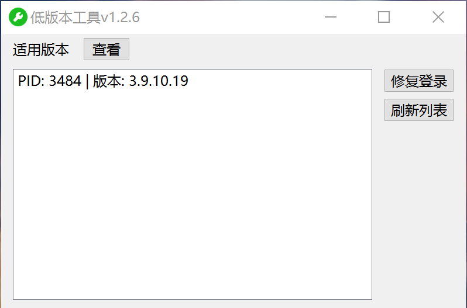

# 微信过低版本工具 

### 下载
[过低版本工具](https://github.com/sqcddzx/WechatVersionTool/releases/tag/WechatVersionTool)

### 界面

<a>
  
</a>

### 说明
工具可能会被杀毒软件误判，请关闭杀毒软件或从隔离中还原工具

方式一：  
  1. 打开微信以及本工具  
  2. 选择进程  
  3. 点击修复版本，弹出修改成功即可  

方式二：
  1. 打开微信
  2. CMD调用 ```低版本工具.exe <PID>```

### 支持
如果工具对您有帮助，请给个⭐或请我喝杯咖啡吧~   
<a>
  
</a>
